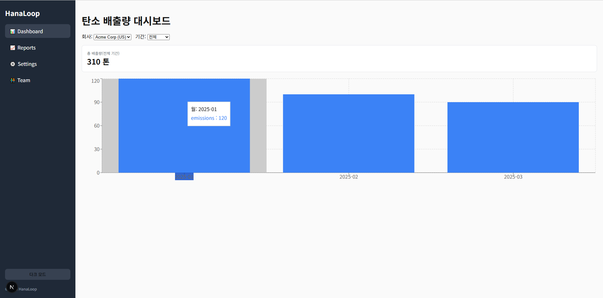

#  탄소 배출량 대시보드 (HanaLoop)

##  개요

Next.js 15 · React 19 · TypeScript 5로 만든 **탄소 배출량 분석 대시보드** 입니다.  

회사별·월별 CO₂ 배출량을 시각화하고, KPI 카드와 다크모드 등 인터렉티브한 UI를 제공합니다.

##  실행 방법

```bash
npm install      # 필요한 패키지 설치
npm run dev      # 개발 서버 실행 (http://localhost:3000)

브라우저에서 http://localhost:3000 주소로 접속하면 대시보드를 볼 수 있습니다.

## 주요 기능

- 회사·기간별 탄소 배출량 그래프 (Recharts)
- 총 배출량 KPI 카드 (CountUp 애니메이션)
- 다크/라이트 모드 전환
- 로딩·에러 처리 및 다시 시도 버튼
- Sidebar 메뉴(App Router 기반)

## 기술 스택
- **Framework** : Next.js 15 (App Router)
- **Language** : TypeScript 5
- **Library** : React 19, Recharts, react-countup
- **Style** : Tailwind CSS, 기본 CSS

##  향후 개선 아이디어
- 게시물(Post) 작성 및 관리 기능 추가
- 에너지원별 스택 바 차트 및 연도별 추세 분석
- CSV / PDF 데이터 내보내기
- 실시간 데이터 예측 및 시뮬레이션


##  개발 노트
Next.js와 TypeScript 기반 환경 세팅부터 설치, 오류 해결, 코드 작성까지 직접 진행하며 구조와 동작 원리를 학습했습니다.

## 🖼️ 스크린샷
